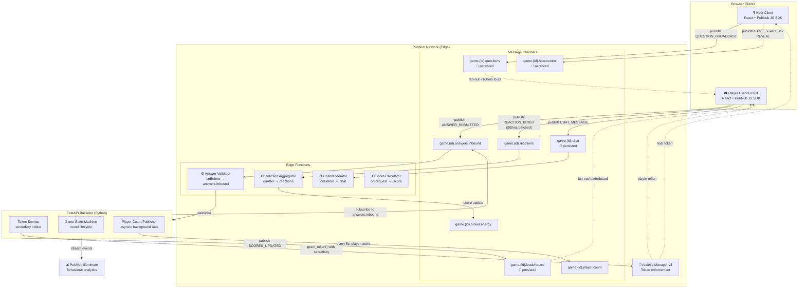
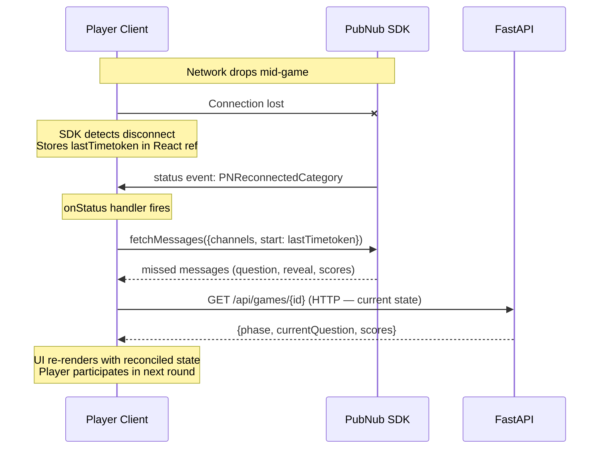

# 03 — System Architecture

---

## ELI5 Version

Imagine a TV game show, but it runs on the internet for thousands of people at once.

- The **host** is like the show's host — they control the game, broadcast questions, and reveal answers.
- The **players** are the audience — they receive questions instantly and tap their answer on their phone.
- **PubNub** is the broadcasting network — it's the infrastructure that makes sure every player gets the question at the same moment, no matter where they are in the world.
- **FastAPI** is the backstage crew — it tracks scores, controls the game flow, and makes sure nobody cheats.

The key insight: PubNub is **one-to-many by default**. When the host publishes a question, PubNub delivers it to all 10,000 players simultaneously. That's what makes this system work at scale — the host doesn't send 10,000 messages; they send one, and PubNub handles the fan-out.

---

## System Overview

---

## Component Breakdown

### Host Client (React + PubNub JS SDK)
Runs in the host's browser. Publishes questions and control events directly to PubNub. The key design choice here is **direct client publishing** — the host client publishes to `game.{id}.questions` without routing through FastAPI. This is PubNub's recommended pattern: clients publish directly for the lowest possible latency. FastAPI doesn't touch the message.

### Player Clients (React + PubNub JS SDK)
Each player has a browser tab. They subscribe to the game channels and publish answers directly to PubNub. Same direct-publish principle — answers go to `game.{id}.answers.inbound` directly, where the Answer Validator Function runs at the edge before delivery.

### PubNub Network
The transport layer. Handles:
- Fan-out (1 message → 10K simultaneous deliveries, <100ms globally)
- Connection management (WebSocket, long-poll fallback)
- Message ordering (timetokens are the canonical ordering key)
- Message persistence (history for catch-up on reconnect)
- Token enforcement (PAM v3 — cryptographic channel permissions)

### PubNub Functions (Edge JS)
Four serverless JS functions running at PubNub's edge nodes, close to where messages are published:
- **Answer Validator** (onBefore): blocks duplicates and malformed answers before delivery
- **Reaction Aggregator** (onAfter): accumulates crowd energy score without blocking reaction delivery
- **Chat Moderator** (onBefore): blocks profanity before any subscriber sees it
- **Score Calculator** (onRequest): REST endpoint called by FastAPI to compute scores

### FastAPI Backend (Python)
Stateful game logic layer. It owns:
- Game state machine (create, start, advance rounds, end)
- Player registry and score tracking
- PAM token issuance (the only component that holds `secretKey`)
- Background task that publishes player count every 5 seconds

### PubNub Illuminate
Behavioral analytics engine. Receives a stream of events from the backend. When the crowd energy crosses a threshold (500 reactions in 60 seconds), Illuminate can trigger a bonus round event — without any backend code change.

---

## Message Flow — Single Game Round

```mermaid
sequenceDiagram
    participant H as Host Client
    participant PN as PubNub
    participant F as Functions
    participant BE as FastAPI
    participant P as Players ×10K

    rect rgb(30, 30, 50)
        Note over H,P: Round Start
        H->>PN: POST /api/games/{id}/question (HTTP to FastAPI)
        BE->>PN: publish QUESTION_BROADCAST → game.{id}.questions
        PN-->>P: fan-out to 10K in <100ms
        Note over P: 30s countdown timer starts (client-side JS, no network cost)
    end

    rect rgb(30, 50, 30)
        Note over P,BE: Answer Collection Window
        P->>PN: publish ANSWER_SUBMITTED → game.{id}.answers.inbound
        PN->>F: onBefore: validate format + KV freq cap check
        F-->>PN: request.ok() / request.abort()
        PN-->>BE: deliver validated answer
        Note over BE: Accumulates answers in memory for 30s
    end

    rect rgb(50, 30, 30)
        Note over H,P: Reveal + Score
        H->>BE: POST /api/games/{id}/reveal (HTTP)
        BE->>F: POST /functions/.../call/score (On-Request)
        F-->>BE: computed scores[]
        BE->>PN: publish ANSWER_REVEAL → game.{id}.host.control
        PN-->>P: reveal to 10K
        BE->>PN: publish SCORES_UPDATED → game.{id}.leaderboard
        PN-->>P: leaderboard to 10K
    end
```

---

## Player Reconnection Flow

**Why the lastTimetoken matters:** PubNub's timetoken is a 17-digit integer (tenths of microseconds since epoch). By storing the timetoken of the last received message, the client can call `fetchMessages({start: lastTimetoken})` to get exactly the messages it missed — no duplicates, no gaps.

---

## Where PubNub Ends and the Application Begins

This boundary is a common interview question. Be explicit about it.

| Responsibility | Owner | Rationale |
|---------------|-------|-----------|
| Message transport and fan-out | **PubNub** | Its core design purpose |
| WebSocket connection management | **PubNub** | Handled transparently by SDK |
| Message ordering (by timetoken) | **PubNub** | Guaranteed on a per-channel basis |
| Edge validation (answer format, duplicates) | **PubNub Functions** | Must run before delivery; edge-native |
| PAM token enforcement | **PubNub** | Cryptographic, at the network layer |
| Game state machine (round lifecycle) | **FastAPI** | Stateful; PubNub is stateless transport |
| Score calculation | **FastAPI** (via Functions On-Request) | Batch logic after window closes |
| Token issuance | **FastAPI** | secretKey must never leave the server |
| UUID generation + localStorage persistence | **Client** | Client-side identity |
| Countdown timer | **Client** | Reduces PubNub traffic; all clients start simultaneously on message receipt |
| Reaction batching (500ms window) | **Client** | 10x transaction reduction before publish |
